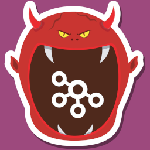

# DO Monstka



This simple repository demonstrates how to consumes and produces messages with Kafka.


### Try it out

You should have `node`, `npm` and `docker` installed on your laptop to launch this project.
Launch the following commands to try it out.

```bash
# Install dependencies
npm i

# Launch a Kafka container 
docker compose up -d

# Build the project and launch the build
npm run build
npm run start

# Send a message to ensure the application is working
npm run send_message "Your message"

```

### Author 

Written by [@GridexX](https://github.com/GridexX) during a rainy day 😶‍🌫️ of May !